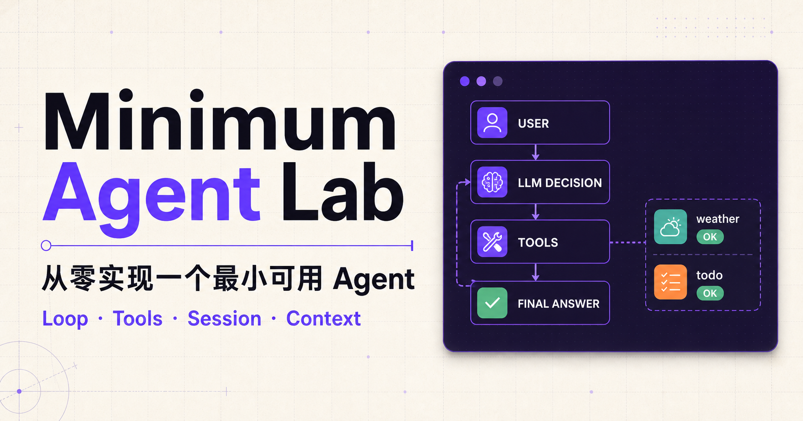
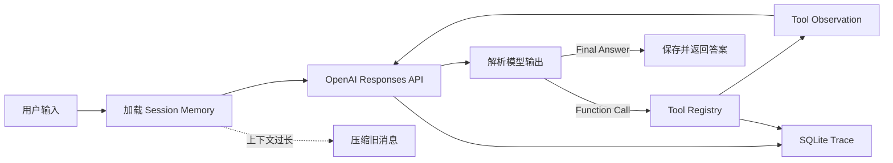
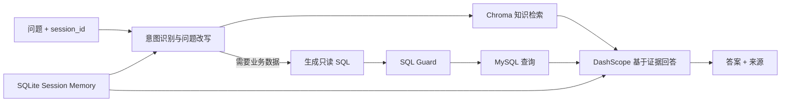

<p align="center">
  
</p>

<h1 align="center">🐶 从零实现一个最小可用 Agent</h1>

<p align="center">
  <strong>不请 Agent 框架当外援，亲手把 Loop、Tools、Memory 和 Trace 一块块装起来。</strong>
</p>

<p align="center">
  <a href="https://cuishaoxin.github.io/-agent-/">🌐 在线体验</a> ·
  <a href="#-五分钟让-agent-开口">🚀 快速开始</a> ·
  <a href="#-两张图看懂它">🗺️ 架构地图</a> ·
  <a href="#-别光信-readme跑测试">🧪 测试</a> ·
  <a href="docs/BACKEND_DEPLOYMENT.md">🚢 部署</a>
</p>

<p align="center">
  
  
  
  
  
</p>

> 🐾 **狗蛋播报：** 这里没有藏在框架调用背后的魔法。模型怎么决定、工具怎么执行、记忆怎么召回、循环怎么停，你都能顺着代码一路追到现场。

这是一个面向学习与实践的 Agent 项目。它先从零实现一个最小 Agent Runtime，再把这套能力扩展成带 RAG、可选 MySQL 查询和 Web 界面的企业智能客服。

> **边界先说清：** Agent Runtime 不依赖 LangGraph、OpenHands、OpenClaw 等 Agent 框架；企业知识库模块使用 LangChain 负责文档加载与切分，使用 ChromaDB 保存向量。该用轮子的地方用轮子，该拆发动机的地方绝不只看引擎盖。

## 🧭 仓库里住着两位 Agent

它们共用一些基础设施，但各有各的工作证：

| 模块 | 适合了解 | 模型与存储 | 入口 |
| --- | --- | --- | --- |
| 最小 Agent Runtime | Agent Loop、Function Calling、Memory、Trace | OpenAI Responses API + SQLite | `mini-agent` |
| 企业智能客服 | 意图识别、RAG、可选业务数据查询、Web 交互 | DashScope + ChromaDB + 可选 MySQL | FastAPI + `website/` |

### ✨ 它们会什么

- 自研 Agent Loop：LLM 决策 → 工具执行 → observation 回填 → 再决策或返回答案
- 工具注册与分发：工具名称、描述、JSON Schema、handler 和统一异常边界
- 4 个示例工具：安全计算器、Mock 搜索、Mock 天气、持久化 Todo
- 按 `user_id + session_id` 隔离的多轮会话记忆
- 超长上下文压缩、最大执行步数和 LLM/工具异常恢复
- SQLite Trace：记录请求、模型决策、工具结果与最终回答
- 企业知识库：Markdown/PDF 加载、切块、Embedding、Chroma 检索与增量上传
- 智能客服编排：意图识别 → RAG → 可选 MySQL → 基于证据生成回答
- FastAPI 接口与 Next.js 交互页面
- 离线单元测试，以及显式启用的真实 API 集成测试——默认不会偷偷烧你的 Token

## 🗺️ 两张图看懂它

### 1. 最小 Agent Runtime：模型不是回答机器，它还会派活



### 2. 企业智能客服：先翻资料，需要时再查账本



## 🚀 五分钟让 Agent 开口

先跑最小版本。它体积不大，但 Loop、工具、记忆和 Trace 一个都没请假。

### 1. 把项目请到本地

```powershell
git clone https://github.com/CUIShaoXin/-agent-.git
cd .\-agent-
python -m venv .venv
.venv\Scripts\Activate.ps1
python -m pip install -e .
```

macOS/Linux 激活虚拟环境时使用：

```bash
source .venv/bin/activate
```

### 2. 给它一把 API Key

项目不会自动读取 `.env`。请在 Shell 或 IDE Run Configuration 中设置环境变量：

```powershell
$env:OPENAI_API_KEY="你的 OpenAI API Key"
$env:OPENAI_MODEL="gpt-5.6-terra"  # 可选
mini-agent --user user-a --session window-1
```

只想问一句，不想和 CLI 促膝长谈？加上 `--once`。想看它刚才忙了什么，再加 `--trace`：

```powershell
mini-agent --user user-a --session window-1 `
  --once "查深圳天气，并记下下班带伞" `
  --trace
```

运行数据默认保存在 `data/agent.db`。关掉终端后记忆还在——狗蛋没有失忆，只是暂时下班。

## 🧠 让它去当企业智能客服

最小 Agent 学会走路以后，就可以去客服岗位实习了。仓库自带位于 `knowledge_base/docs/` 的演示资料；首次使用需要 DashScope API Key。MySQL 是选修课，只在查询库存、订单等实时业务数据时需要，纯知识库问答不受影响。

### 1. 先让它读资料

```powershell
$env:DASHSCOPE_API_KEY="你的 DashScope API Key"
$env:DASHSCOPE_CHAT_MODEL="qwen-plus"
$env:DASHSCOPE_EMBEDDING_MODEL="text-embedding-v3"
build-knowledge --rebuild
```

默认目录：

```text
knowledge_base/
├── docs/       # Markdown/PDF 原始资料
└── chroma_db/  # 本地 ChromaDB 持久化数据
```

如需使用自己的资料，可将 `.md`/`.pdf` 放入目录后执行：

```powershell
build-knowledge --source-dir "D:\path\to\your-docs" --rebuild
```

### 2. 支起 FastAPI 柜台

```powershell
python -m uvicorn min_agent.api:app --host 0.0.0.0 --port 8000
```

确认服务状态：

```powershell
Invoke-RestMethod http://localhost:8000/health
```

### 3. 打开客服窗口

打开另一个终端：

```powershell
cd website
Copy-Item .env.example .env.local
npm install
npm run dev
```

`website/.env.local` 默认指向本地后端：

```dotenv
VITE_API_BASE_URL=http://localhost:8000
```

然后访问 [http://localhost:3000](http://localhost:3000)。

### 4. 可选：把只读账本递给它

```powershell
$env:MYSQL_HOST="127.0.0.1"
$env:MYSQL_PORT="3306"
$env:MYSQL_USER="agent_readonly"
$env:MYSQL_PASSWORD="只读账号密码"
$env:MYSQL_DATABASE="enterprise"
$env:MYSQL_ALLOWED_TABLES="products,inventory,orders"
```

请使用只有 `SELECT` 权限的专用账号，不要把 `root` 钥匙串整串交出去：

```sql
CREATE USER 'agent_readonly'@'%' IDENTIFIED BY 'replace-with-strong-password';
GRANT SELECT ON enterprise.* TO 'agent_readonly'@'%';
```

代码还会安排 SQL Guard 站岗：只允许单条 `SELECT`，拒绝注释、危险关键字、系统库和多语句，并自动限制最大返回行数。只读账号是第一道门，SQL Guard 是第二道。

## 🔌 API：给前端留三扇门

| 方法 | 路径 | 说明 |
| --- | --- | --- |
| `GET` | `/health` | 检查 LLM、知识库和 MySQL 配置状态 |
| `POST` | `/chat` | 发起客服对话，返回答案、意图、来源和 Session ID |
| `POST` | `/knowledge/upload` | 上传 `.md`/`.pdf`，切块后增量写入 Chroma |
| `GET` | `/docs` | FastAPI 自动生成的交互式接口文档 |

聊天示例：

```powershell
$body = @{
  message = "公司的主营业务是什么？"
  session_id = "demo-1"
} | ConvertTo-Json

Invoke-RestMethod http://localhost:8000/chat `
  -Method Post `
  -ContentType "application/json" `
  -Body $body
```

上传资料：

```powershell
curl.exe -X POST http://localhost:8000/knowledge/upload `
  -F "file=@knowledge_base/docs/华辰服饰有限公司_FAQ.md"
```

## 🧳 项目的行李箱

如果你准备顺着源码学习，建议从 `runtime.py` 出发，再依次看 `tools.py`、`storage.py` 和 `llm.py`。客服链路则从 `customer_agent.py` 开始。

```text
.
├── src/min_agent/
│   ├── runtime.py            # Agent Loop 与最大步数控制
│   ├── llm.py                # OpenAI Responses API 与输出解析
│   ├── tools.py              # 工具注册、Schema、执行与异常边界
│   ├── storage.py            # SQLite Session、Message、Todo、Trace
│   ├── cli.py                # 最小 Agent 命令行入口
│   ├── customer_agent.py     # 智能客服编排
│   ├── dashscope_service.py  # DashScope 调用封装
│   ├── knowledge_builder.py  # 文档加载、切块与 Chroma 构建
│   ├── knowledge.py          # 知识检索与增量上传
│   ├── mysql_database.py     # MySQL 只读查询与 SQL Guard
│   └── api.py                # FastAPI 接口
├── knowledge_base/           # 演示资料与本地向量库
├── website/                  # Next.js / React 交互网站
├── tests/                    # 单元测试与真实 API 测试
├── scripts/                  # 知识库、RAG 验证脚本
├── docs/                     # 部署、录屏与开发记录
├── Dockerfile                # 后端容器镜像
└── render.yaml               # Render 部署配置
```

## 🔍 拆开看看：关键设计

### 🔧 工具调用：让模型派活，Runtime 干活

模型根据 JSON Schema 自主决定是否调用工具，Runtime 不使用关键词路由。工具执行无论成功还是失败，都会被转换为 observation 回填给模型；单个工具异常不会直接终止整个 Agent。

### 🧠 Session Memory：记得你，但不串台

`sessions`、`messages` 和 `todos` 使用 `user_id + session_id` 作为隔离维度。同一用户的不同会话窗口拥有独立记忆链。较早消息会被压缩为确定性摘要，近期原文继续参与上下文。

项目不保存隐藏的 chain-of-thought。只有 API 明确提供的安全 reasoning summary 才会写入 Trace。

### 📚 RAG：回答之前先翻书

Markdown 使用 `TextLoader`，PDF 使用 `PyPDFLoader`。文档默认按约 500 tokens、100 tokens overlap 切分，并保存来源文件、分类、公司、页码和 chunk 序号等 metadata。查询结果经过最低相似度过滤后交给模型，最终回答会携带来源文件。

## 🎛️ 常用配置：旋钮都在这里

完整示例见 [`.env.example`](.env.example)。常用项如下：

| 环境变量 | 默认值 | 用途 |
| --- | --- | --- |
| `OPENAI_API_KEY` | 空 | 最小 Agent 的 OpenAI Key |
| `OPENAI_MODEL` | `gpt-5.6-terra` | 最小 Agent 模型 |
| `DASHSCOPE_API_KEY` | 空 | 客服对话与知识库 Embedding |
| `DASHSCOPE_CHAT_MODEL` / `MODEL_NAME` | `qwen-plus` | 客服模型 |
| `DASHSCOPE_EMBEDDING_MODEL` | `text-embedding-v3` | Embedding 模型 |
| `AGENT_DB_PATH` | `data/agent.db` | Session 与 Trace 数据库 |
| `AGENT_CONTEXT_MESSAGES` | `12` | 保留的近期上下文条数 |
| `CHROMA_DB_PATH` / `CHROMA_PERSIST_DIR` | `knowledge_base/chroma_db` | Chroma 持久化目录 |
| `KNOWLEDGE_AUTO_BUILD` | `false` | 空知识库时是否自动构建 |
| `RAG_TOP_K` | `5` | 最大召回条数 |
| `RAG_MIN_SCORE` | `0.45` | 最低相似度阈值 |
| `CORS_ORIGINS` | 本地与项目 Pages 地址 | 允许访问 API 的前端来源 |

## 🧪 别光信 README，跑测试

无需 API Key，也不会产生模型费用：

```powershell
python -m unittest discover -s tests -v
```

前端检查：

```powershell
cd website
npm run lint
npm test
```

真实 API 测试会产生费用，所以默认装睡。确认 Key 和余额后再主动叫醒：

```powershell
$env:OPENAI_API_KEY="你的 OpenAI API Key"
$env:RUN_REAL_API_TEST="1"
python -m unittest tests.test_real_api -v

$env:DASHSCOPE_API_KEY="你的 DashScope API Key"
$env:RUN_OFFLINE_KB_TEST="1"
python -m unittest tests.test_real_offline_knowledge -v
```

使用已有 Chroma 数据验证完整 RAG 链路：

```powershell
python scripts/verify_knowledge.py
python scripts/verify_rag_agent.py
```

## 🚢 把它送上云

- 前端：`.github/workflows/pages.yml` 构建并发布 `website/` 到 GitHub Pages。
- 后端：仓库提供 `Dockerfile` 和 `render.yaml`，可部署到 Render 或其他容器平台。
- 前端生产构建需要在 GitHub Actions Variables 中配置 `VITE_API_BASE_URL`，值为公开可访问的 HTTPS 后端地址。

完整步骤见 [`docs/BACKEND_DEPLOYMENT.md`](docs/BACKEND_DEPLOYMENT.md)。

## 📚 继续翻资料

- [`docs/AI_PROMPTS_AND_LOG.md`](docs/AI_PROMPTS_AND_LOG.md)：AI Prompt 与问题解决记录
- [`docs/RECORDING_SCRIPT.md`](docs/RECORDING_SCRIPT.md)：演示与录屏操作稿
- [`docs/BACKEND_DEPLOYMENT.md`](docs/BACKEND_DEPLOYMENT.md)：后端与 GitHub Pages 联调部署

## ⚠️ 狗蛋能干活，但钥匙还得你保管

- `search` 与 `weather` 是教学用 Mock 工具，别拿它查明天到底下不下雨；计算器和 Todo 是真实本地工具。
- 计算器使用 AST 白名单解析，不调用危险的 `eval()`。
- 不要提交 `.env`、API Key、数据库密码或包含敏感对话的 SQLite 文件。
- 公开仓库中的知识库资料应为脱敏演示数据；真实企业资料应使用私有存储。
- 当前存储适合教学与单机部署。生产多实例应接入共享数据库/向量服务，并补充鉴权、限流与可观测性。

## 🔗 参考

- [OpenAI Function calling](https://developers.openai.com/api/docs/guides/function-calling)
- [OpenAI Responses API](https://developers.openai.com/api/reference/resources/responses/methods/create)
