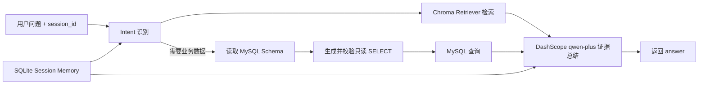
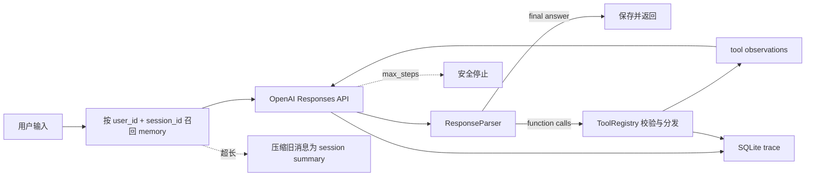

# 从零实现一个最小可用 Agent

这是一个不依赖 LangGraph、OpenHands、OpenClaw 或任何 Agent 框架的教学项目。核心循环、工具注册/分发、OpenAI 输出解析、session memory、context 压缩、异常恢复和 trace 均由项目自行实现。

## 功能清单

- 真实 OpenAI Responses API（默认 `gpt-5.6-terra`，环境变量可替换）
- 自研 Agent Loop：输入 → LLM 决策 → 工具执行 → observation → 再决策/最终答案
- 4 个工具：安全计算器、mock search、mock weather、持久化 todo
- 工具注册机制：名称、描述、JSON Schema、handler
- 输出解析：安全 reasoning summary、function call、final answer、坏 JSON 参数
- SQLite session 隔离与多轮追问
- LangChain 文档加载/切分 + DashScope `text-embedding-v3` + ChromaDB 离线企业知识库
- 基础 context 压缩、最大执行步数、工具/API 异常处理
- SQLite 完整 trace
- 无网络单测 + opt-in 真实 API 集成测试

## 快速运行

要求 Python 3.10+。

```powershell
python -m venv .venv
.venv\Scripts\Activate.ps1
python -m pip install -e .
$env:OPENAI_API_KEY="你的 API Key"
mini-agent --user A --session window-1
```

单次调用和查看 trace：

```powershell
mini-agent --user A --session window-1 --once "查深圳天气并记下下班带伞" --trace
```

默认数据保存在 `data/agent.db`。可复制 `.env.example` 了解可配置项；本项目不自动读取 `.env`，避免额外依赖，请把变量设置到 Shell 或 IDE Run Configuration。

## 真实智能客服 API

智能客服页面不再使用关键词 Mock 回复，而是调用独立 FastAPI 服务：

```powershell
python -m pip install -e .
$env:DASHSCOPE_API_KEY="你的 DashScope API Key"
$env:DASHSCOPE_CHAT_MODEL="qwen-plus"
$env:KNOWLEDGE_SOURCE_DIR="C:\Users\cui\Desktop\clothing_company_knowledge_base"
$env:MYSQL_HOST="127.0.0.1"
$env:MYSQL_USER="agent_readonly"
$env:MYSQL_PASSWORD="你的只读账号密码"
$env:MYSQL_DATABASE="enterprise"
python -m uvicorn min_agent.api:app --host 0.0.0.0 --port 8000
```

接口：

- `POST /chat`：请求体为 `{"message":"...","session_id":"..."}`；`session_id` 可省略，后端会自动生成。
- `POST /knowledge/upload`：上传 `.md` 或 `.pdf` 企业资料，自动切块并写入同一个 Chroma 集合。
- `GET /health`：查看 LLM、MySQL 和知识库是否就绪。
- `GET /docs`：FastAPI 自动生成的接口调试页面。

上传知识库示例：

```powershell
curl.exe -X POST http://localhost:8000/knowledge/upload -F "file=@docs/company-faq.md"
```

调用聊天接口：

```powershell
$body = @{ message = "公司的售后政策是什么？"; session_id = "window-1" } | ConvertTo-Json
Invoke-RestMethod http://localhost:8000/chat -Method Post -ContentType "application/json" -Body $body
```

前端复制 `website/.env.example` 为 `website/.env.local`，把 `VITE_API_BASE_URL` 设置为后端地址。线上 GitHub Pages 在仓库 Actions Variables 中配置同名变量。公网部署步骤见 `docs/BACKEND_DEPLOYMENT.md`。

智能客服页面的“本次会话”卡片内仍保留“上传知识库”入口。离线目录会在服务启动时自动加载，因此日常使用不需要重复上传。

## 企业知识库离线构建

### 目录约定

```text
knowledge_base/
├── docs/       # 从 KNOWLEDGE_SOURCE_DIR 同步的 Markdown/PDF
└── chroma_db/  # 本地持久化 ChromaDB（不提交 Git）
```

默认会优先识别当前用户桌面的 `clothing_company_knowledge_base` 目录；生产环境建议显式配置：

```powershell
$env:DASHSCOPE_API_KEY="你的 DashScope API Key"
$env:DASHSCOPE_EMBEDDING_MODEL="text-embedding-v3"
$env:KNOWLEDGE_SOURCE_DIR="C:\Users\cui\Desktop\clothing_company_knowledge_base"
$env:KNOWLEDGE_DOCS_DIR="knowledge_base/docs"
$env:CHROMA_DB_PATH="knowledge_base/chroma_db"
$env:CHROMA_COLLECTION_NAME="huachen_enterprise"
$env:KNOWLEDGE_CHUNK_SIZE="500"
$env:KNOWLEDGE_CHUNK_OVERLAP="100"
$env:KNOWLEDGE_AUTO_BUILD="false"
$env:RAG_MIN_SCORE="0.45"
```

先运行一次 `build-knowledge --rebuild` 构建知识库。FastAPI 默认采用严格加载模式：

1. 初始化 `DashScopeEmbeddings(model="text-embedding-v3")`。
2. 检查 Chroma collection 是否已有数据。
3. 已存在则直接创建 Retriever，不重新 Embedding，并输出 `Knowledge Base Ready`。
4. 不存在或集合为空则停止启动并提示先执行知识库构建。

如需开发环境首次启动时自动构建，可显式设置 `KNOWLEDGE_AUTO_BUILD=true`。Markdown 使用
`TextLoader`，PDF 使用 `PyPDFLoader`，并使用 token 计数的
`RecursiveCharacterTextSplitter` 按约 500 tokens、100 tokens overlap 切分。

每个 chunk 保留以下 metadata：

```json
{
  "source": "华辰服饰有限公司_生产流程.pdf",
  "category": "生产流程",
  "company": "华辰服饰有限公司",
  "page_number": 1,
  "chunk_index": 0
}
```

也可以在启动服务前手动构建或强制重建：

```powershell
python -m pip install -e .
build-knowledge
build-knowledge --rebuild
python scripts/verify_knowledge.py
```

完成后启动 Agent：

```powershell
python -m uvicorn min_agent.api:app --host 0.0.0.0 --port 8000
```

`GET /health` 中的 `knowledge_backend`、`knowledge_documents`、`knowledge_chunks`、`embedding_model`
和 `model` 可用于确认加载状态。

完整真实 RAG 验证：

```powershell
python scripts/verify_rag_agent.py
```

脚本使用已有 Chroma，不会重新构建知识库，并依次验证公司介绍、库存管理和生产流程三个问题的
召回来源及 Qwen 最终回答。

### 智能客服调用流程



### MySQL 连接与安全

连接参数全部来自环境变量：`MYSQL_HOST`、`MYSQL_PORT`、`MYSQL_USER`、`MYSQL_PASSWORD`、`MYSQL_DATABASE`。`MYSQL_ALLOWED_TABLES` 可限制 Agent 能查询的业务表，`MYSQL_MAX_ROWS` 控制最大返回行数。

请为 Agent 创建只读账号，不要使用 root：

```sql
CREATE USER 'agent_readonly'@'%' IDENTIFIED BY 'replace-with-strong-password';
GRANT SELECT ON enterprise.* TO 'agent_readonly'@'%';
```

后端还会执行第二层 SQL Guard：只允许单条 `SELECT`、禁止注释和危险关键字、禁止系统库，并自动添加 `LIMIT`。MySQL 查询失败时会作为受控 observation 交给总结模型，不向前端暴露连接密码。

## 系统设计



核心文件：

- `src/min_agent/runtime.py`：自行实现的 while/for Agent Loop 和最大步数。
- `src/min_agent/tools.py`：注册表、schema、4 个工具与统一异常边界。
- `src/min_agent/llm.py`：原生 HTTP 调用 Responses API，解析 provider 输出。
- `src/min_agent/storage.py`：SQLite messages、summary、todos、traces。
- `src/min_agent/cli.py`：终端交互入口。
- `src/min_agent/api.py`：`/chat`、知识库上传与健康检查接口。
- `src/min_agent/customer_agent.py`：Intent → RAG → MySQL → LLM 的客服 Agent 编排。
- `src/min_agent/knowledge_builder.py`：离线目录扫描、Loader、token 切分、metadata 与 Chroma 构建。
- `src/min_agent/knowledge.py`：Chroma VectorStore、Retriever、在线查询与增量上传适配层。
- `src/min_agent/mysql_database.py`：MySQL schema 读取、只读校验和查询。

## Loop 如何工作

1. 保存用户输入，以 `(user_id, session_id)` 召回该窗口 memory。
2. 将近期 context、当前 loop continuation 和工具 schemas 发给 LLM。
3. `ResponseParser` 判断响应包含工具调用还是最终答案。
4. 如果有工具调用，注册表执行工具；成功或失败都转成 observation 回填给 LLM。
5. LLM 可继续调用工具，或输出最终答案；达到 `max_steps` 时强制停止。

模型基于 JSON Schema 自主选工具，Runtime 不写关键词路由。

## Session 与 memory 设计

### 隔离键

数据库中的 sessions、messages、todos 均使用 `user_id + session_id`。同一个用户的 `window-1` 和 `window-2` 从存储层就是两条独立记忆链，因此可交替继续对话而不会串线。

### 召回时机与放置方式

每次 `run()` 开始，在保存本轮用户消息后立即召回：

1. `session.summary` 作为 `developer` context，说明更早的会话事实；
2. 最近 N 条 user/assistant 原文按时间顺序放入 context；
3. 旧 tool observation 以带工具名的历史 observation 放入 context；
4. 当前 loop 内使用 API 原生 `function_call` / `function_call_output`，保证 call_id 对齐。

不保存隐藏 chain-of-thought。仅在 API 明确返回 `reasoning.summary` 时解析安全摘要到 trace；长期 memory 保存用户输入、最终回答、有用的工具观察和压缩摘要。这样既支持追问，也避免把冗长、敏感且不稳定的推理文本塞进 context。

### 基础压缩

未压缩消息超过 `AGENT_CONTEXT_MESSAGES` 时，旧消息被截取、归一化成确定性 bullet summary（最多 4000 字符），原记录标记为 compacted，近期消息原样保留。这是最小实现；生产系统可换成 token 计数 + LLM 摘要 + 事实 memory。

## 测试

无需 API Key 的稳定测试：

```powershell
python -m unittest discover -s tests -v
```

覆盖直接回答、工具多步 loop、输出解析、工具异常、最大步数、session/todo 隔离、追问 context、压缩和 trace。

真实 API 集成测试（会产生 API 费用）：

```powershell
$env:OPENAI_API_KEY="你的 API Key"
$env:RUN_REAL_API_TEST="1"
python -m unittest tests.test_real_api -v
```

真实企业知识库召回测试（会调用 DashScope Embedding 并产生费用）：

```powershell
$env:DASHSCOPE_API_KEY="你的 DashScope API Key"
$env:RUN_OFFLINE_KB_TEST="1"
python -m unittest tests.test_real_offline_knowledge -v
```

该测试覆盖：

- “华辰服饰公司的主营业务是什么？” → `公司介绍.md`
- “库存管理流程是什么？” → `库存管理.pdf`
- “生产流程有哪些步骤？” → `生产流程.pdf`

## Trace

每轮会记录：`run_start`、`llm_request`、`llm_response`、`tool_result`、`run_end`、`llm_error` 或 `max_steps_reached`。CLI 的 `--trace` 可查看 JSON；生产环境可将 `SQLiteStore.trace` 替换成 OpenTelemetry。

## 提交材料

- 代码：当前仓库；推送 GitHub 后把仓库 URL 填到作业平台。
- README：本文件。
- AI Prompt 与解决记录：`docs/AI_PROMPTS_AND_LOG.md`。
- 录屏操作稿：`docs/RECORDING_SCRIPT.md`。
- 终端录屏：按脚本自行录制，尤其不要录入 API Key。

## 设计取舍与边界

- `search` 和 `weather` 按题目许可使用 mock，回答会标明来源；计算器与 todo 是真实本地工具。
- 真实 LLM 连接只依赖 Python 标准库，降低项目复杂度；可按需换成官方 SDK，但不会改变 Runtime。
- JSON Schema 主要由模型/API 约束，handler 仍做必要业务校验；完整 JSON Schema validator 不在最小范围内。
- SQLite 继续负责 session/trace；ChromaDB 负责企业知识向量。线上多实例应使用共享向量服务、鉴权、限流和可观测平台。

## 安全提示

不要提交 `.env`、API Key 或包含敏感对话的数据库。计算器使用 AST 白名单，不使用危险的 `eval()`。

## 参考

实现遵循 OpenAI 官方的 [Function calling 指南](https://developers.openai.com/api/docs/guides/function-calling) 与 [Responses API create 参考](https://developers.openai.com/api/reference/resources/responses/methods/create)。
